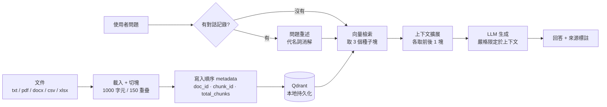

# Contextual RAG Chatbot

**上下文感知檢索的繁體中文文件問答系統** — 可在 OpenAI API 與本地 GPU 之間切換後端。

`LangChain 0.3` · `Qdrant` · `Gradio 4` · `OpenAI GPT-4o` / `Ollama + Qwen2.5`

---

## 這個專案在解決什麼問題

一般 RAG 的做法是：把文件切成固定長度的塊、向量化、查詢時取最相似的 k 塊丟給 LLM。

問題在於**固定長度切塊會把完整的語意切斷**。舉例：文件裡寫「殘差補償校準法可將量化精度損失由 2.1% 降至 0.4%，代價是增加約 6% 的片上記憶體使用量」——如果切塊邊界剛好落在中間，檢索命中前半段時，LLM 永遠看不到「代價」那半句，於是給出一個不完整但看起來很有自信的答案。

這個專案的做法是**在檢索層補回被切斷的上下文**：命中一個塊之後，順著它在原文中的位置，把前後相鄰的塊也一起取出來。



---

## 核心設計

### 1. 上下文感知檢索器

純 top-k 檢索取回的是「語意最相似的碎片集合」，彼此可能來自文件的不同角落，缺少連貫性。這裡的 `ContextualRetriever` 繼承 LangChain 的 `BaseRetriever`，在切塊階段就為每個塊寫入三個 metadata：

| 欄位 | 用途 |
|---|---|
| `doc_id` | 來源文件的雜湊，區分不同文件 |
| `chunk_id` | 該塊在文件中的序號 |
| `total_chunks_in_doc` | 文件總塊數，用於邊界判斷 |

檢索時先取 3 個種子塊，再對每個種子以 `doc_id + chunk_id ± 1` 建構 Qdrant filter 精準撈出鄰居，最後依 `(doc_id, chunk_id)` 排序後交給 LLM，讓上下文以**原文順序**呈現而非相似度順序。

實作：[`src/contextual_retriever.py`](src/contextual_retriever.py)

### 2. 檢索覆蓋率 — 一個容易被忽略的評測前提

檢索器的效果無法用「答對了」來證明。若語料只有 2 個塊，而檢索最多取 9 塊，那**整份文件每次都會被完整塞進 prompt**，此時 RAG 已退化為「長上下文問答」，測不出檢索的任何貢獻。

因此本專案定義：

```
檢索覆蓋率 = min(語料總塊數, k × (1 + 2 × 窗口大小)) / 語料總塊數
```

覆蓋率必須明顯低於 100%，測試才有意義。`test_docs/` 中的語料經過調整，覆蓋率為 **75%**（9 / 12 塊）。

### 3. 雙後端抽象

`LLM_PROVIDER` 環境變數在兩個後端之間切換，其餘程式碼完全共用：

| | OpenAI | 本地 Ollama |
|---|---|---|
| 生成模型 | `gpt-4o` | `qwen2.5:3b` |
| 嵌入模型 | `text-embedding-3-small`（1536 維） | `bge-m3`（1024 維） |
| 需要 API key | 是 | 否 |
| 資料外流 | 是 | 否 |

兩者的向量維度不同，因此 Qdrant collection 名稱帶上 provider（`rag_collection_contextual_{provider}_v1`），避免切換後端時誤用維度不符的舊集合。嵌入維度不寫死，改用 `embed_query()` 探測後再建立 collection。

實作：[`src/rag_system.py`](src/rag_system.py) · [`src/config.py`](src/config.py)

### 4. Prompt 的兩個職責

- **QA prompt** — 嚴格限定僅依據上下文回答，且指定「找不到」時的固定句式，讓幻覺可被機械化檢出
- **Condense-question prompt** — 把「**它**的售價呢？」這種依賴對話記錄的追問，重述為自包含的獨立問題後才送去檢索。少了這一步，代名詞會直接進向量檢索，撈回一堆無關的塊

---

## 評測方法

`test_docs/` 內含一組虛構語料與 [`測試問題清單.md`](test_docs/測試問題清單.md)（23 題，附正確答案），刻意分成六類：

| 類別 | 題數 | 檢驗目標 |
|---|---|---|
| A 單點事實 | 6 | 基本檢索。植入專利號、證號等精確值作為幻覺偵測器 |
| B 跨 chunk 邊界 | 3 | **上下文擴展的核心價值**。答案的兩半分處相鄰塊 |
| C 多處彙整 | 3 | 跨段落整合能力 |
| D 表格檔案 | 4 | CSV / Excel loader 與多工作表處理 |
| E 負面測試 | 4 | **最重要**。問語料中不存在的事，檢驗是否誠實回答「找不到」 |
| F 對話記憶 | 3 | 代名詞消解，驗證 condense-question 生效 |

E 組是判斷一個 RAG 系統可不可信的關鍵：能答對問題不難，肯承認不知道才難。

---

## 實測結果

**本地 Ollama 後端**（`qwen2.5:3b` Q4_K_M，i7-8700 純 CPU）：

| 題 | 檢驗目標 | 結果 | 耗時 |
|---|---|---|---|
| A1 | 單點事實 | ✅ 數值正確 | 42.9s |
| B1 | 跨 chunk 邊界 | ✅ 定義與兩項代價全數取得 | 52.0s |
| E1 | 負面測試 | ✅ 誠實回答找不到，未編造 | 38.4s |
| F2 | 代名詞消解 | ✅ 正確承接前文 | 42.0s |

`bge-m3` 建索引 1.66 秒/塊。3B 模型在 E、F 兩組的表現優於預期 —— 嚴格的 prompt 設計對小模型的引導效果比想像中有效。

OpenAI 後端已完成整合，並通過離線驗證（載入、切塊、metadata、Qdrant 讀寫、檢索擴展、UI 渲染），尚未以真實 API key 進行線上實測。

---

## 工程決策記錄

開發過程中處理的幾個非顯而易見的問題，記錄於此以免重蹈：

**依賴必須釘上版本上限。** 原本 `requirements.txt` 全用 `>=`，pip 會裝到 LangChain 1.x 與 Gradio 6，而 LangChain 1.0 移除了 `langchain.chains` / `.memory` / `.prompts` / `.text_splitter` 四個模組路徑，Gradio 6 移除了 `Chatbot(type=...)`。連帶還有兩個間接相依的坑：`huggingface_hub` 1.x 移除 `HfFolder`，`starlette` 1.x 移除 `TemplateResponse` 的舊簽名——後者最難查，伺服器回 HTTP 200、瀏覽器 console 無錯誤、所有 JS 資源正常載入，畫面卻永遠停在 `Loading...`，只有伺服器端 log 裡一行 `TypeError: unhashable type: 'dict'`。

**中文語料的 `chunk_size` 陷阱。** `RecursiveCharacterTextSplitter` 的 `length_function=len` 計算的是**字元**。UTF-8 中文一字 3 bytes，因此一份 9 KB 的中文檔只有約 3,000 字元，僅切出 5 塊。要達到有意義的檢索覆蓋率，中文語料需要 30 KB 以上。

**Pascal 顯卡的 CUDA 相容性。** GTX 1050 Ti（compute capability 6.1）搭配驅動 560.94（支援上限 CUDA 12.6）時，Ollama 的 `cuda_v12` runner 因 PTX 由更新的 toolkit 編譯而無法 JIT，`llama-server` 以 `0xc0000409` 崩潰。判斷關鍵是錯誤訊息 `the provided PTX was compiled with an unsupported toolchain` 指向驅動而非程式碼。解法為升級至 580.x 分支；期間以 `scripts/run_ollama_cpu.ps1` 另起一個停用 CUDA 的 Ollama 實例於 11435 埠，不影響原服務且共用模型檔案。

**4 GB VRAM 的模型排程。** 桌面顯示常駐約 1 GB，實際可用僅約 3 GB。`qwen2.5:3b` Q4（1.9 GB）與 `bge-m3`（1.2 GB）無法同時常駐，因此設定 `OLLAMA_MAX_LOADED_MODELS=1`，讓建索引與查詢兩階段各自載入所需模型，換入換出的代價遠低於整個模型 offload 到 CPU。

**路徑錨點。** 所有資料路徑改以 `PROJECT_ROOT = Path(__file__).resolve().parent.parent` 推導，而非相對於工作目錄，避免從不同位置啟動時在錯誤的地方建立資料夾。

---

## 快速開始

```bash
pip install -r requirements.txt
```

### OpenAI 後端

```powershell
$env:OPENAI_API_KEY = "sk-your-key-here"
./scripts/run_openai.ps1
```

### 本地 Ollama 後端（不需 API key）

```bash
ollama pull qwen2.5:3b
ollama pull bge-m3
```

```powershell
./scripts/run_ollama.ps1
```

GPU 驅動的 CUDA 版本過舊時，改用純 CPU 版本：

```powershell
./scripts/run_ollama_cpu.ps1
```

啟動後開啟 `http://127.0.0.1:7860`，上傳 `test_docs/` 內的檔案，即可依測試問題清單逐題驗證。

### 環境變數

| 變數 | 說明 | 預設 |
|---|---|---|
| `LLM_PROVIDER` | `openai` 或 `ollama` | `openai` |
| `OLLAMA_CHAT_MODEL` | 生成模型 | `qwen2.5:3b` |
| `OLLAMA_EMBED_MODEL` | 嵌入模型 | `bge-m3` |
| `OLLAMA_NUM_CTX` | 上下文窗口，愈大愈吃 VRAM | `8192` |
| `RAG_PYTHON` | 指定 Python 解譯器路徑 | 自動偵測 |

啟動腳本會依序尋找 Python：`RAG_PYTHON` 環境變數 → conda 環境 `RAG_damo` → PATH 上的 `python`。使用其他虛擬環境時設定 `RAG_PYTHON` 指向該環境的 `python.exe` 即可，無需修改腳本。

---

## 專案結構

```
├── app.py                        # Gradio 介面與應用入口
├── src/
│   ├── config.py                 # 後端切換、模型設定、路徑錨點、啟動前檢查
│   ├── document_loader.py        # 五種格式載入 + 切塊 + 順序 metadata
│   ├── contextual_retriever.py   # 上下文感知檢索器
│   ├── rag_system.py             # 嵌入 / LLM / 對話鏈組裝
│   └── qdrant_vector_store.py    # Qdrant 包裝層
├── scripts/                      # 三種後端的啟動腳本與安裝腳本
├── test_docs/                    # 測試語料與 23 題評測清單
├── data/                         # 執行時產生（uploaded_docs 每次處理會被清空）
└── .cache/                       # tiktoken / matplotlib 快取
```

支援格式：TXT、PDF、DOCX、CSV、Excel（含多工作表；CSV 具 utf-8 / cp950 / big5 編碼 fallback）。

---

## 已知限制與後續方向

- **LangChain legacy API** — `ConversationalRetrievalChain` 與 `ConversationBufferMemory` 在 0.3 已標記 deprecated，遷移至 LCEL 或 LangGraph 是下一步，目前為維持穩定而暫留
- **上下文擴展的 API 成本** — 取相鄰塊時使用 `similarity_search` 搭配 filter，為了撈一個已知 ID 的塊而多打一次 embedding；改用 Qdrant 的 `scroll` 可省去每塊一次呼叫
- **固定窗口** — 前後各一塊為固定值，未依語意邊界動態調整
- **評測規模** — 23 題足以驗證機制，不足以做統計性比較

---

## 致謝

LangChain · Qdrant · Gradio · Ollama · OpenAI
